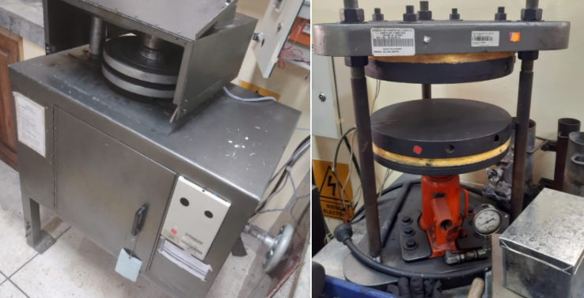
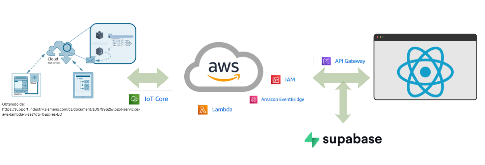
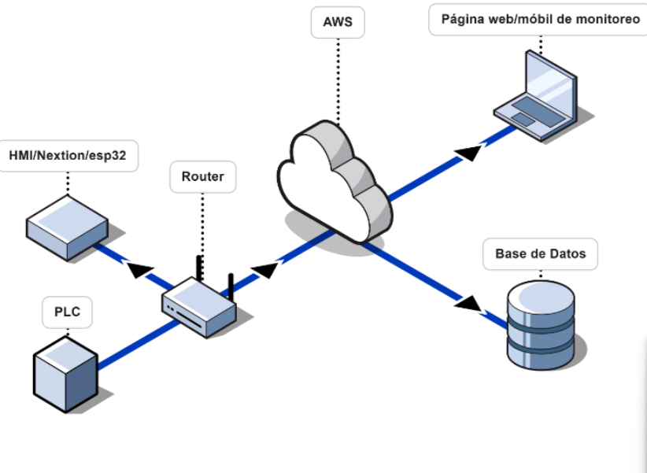
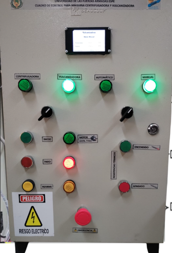
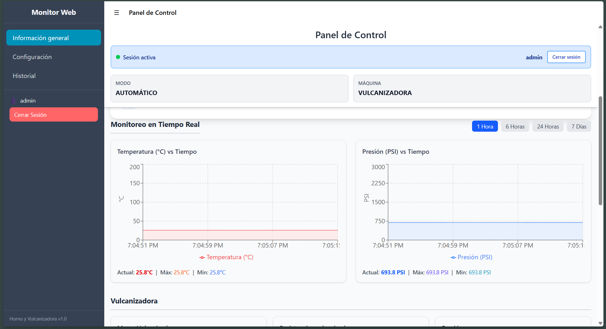

# 🔧 Modernización y Automatización de Vulcanizadora y Equipo de Colado Centrífugo

## 📌 Descripción General

Este proyecto consistió en la evaluación técnica, modernización y automatización de una **vulcanizadora** y un **equipo de colado centrífugo** que se encontraban fuera de operación.

Se realizó un diagnóstico completo del estado eléctrico y de control de ambas máquinas, seguido de una propuesta de modernización para restablecer su funcionamiento e integrar capacidades de monitoreo y control remoto bajo un enfoque de **Industria 4.0**.

---

## 🏭 Fase 1: Evaluación y Diagnóstico

- Inspección del estado inicial de los equipos.
- Identificación de fallas eléctricas y de control.
- Análisis de requerimientos técnicos para su reacondicionamiento.
- Elaboración de propuesta de modernización.

---

## ⚙️ Fase 2: Automatización Industrial

- Diseño e implementación de un **tablero de control**.
- Integración de un **PLC** para automatización del proceso.
- Instrumentación de variables críticas:
  - Presión
  - Temperatura
- Captura y transmisión de estados de sensores y actuadores.

---

## ☁️ Fase 3: Integración IoT y Arquitectura en la Nube

- Integración del sistema mediante **AWS IoT Core**.
- Comunicación del PLC con la nube para supervisión remota.
- Uso de:
  - AWS Lambda
  - Amazon EventBridge  
- Procesamiento de eventos y ejecución de funciones en la nube.
- Desarrollo de una **API** para exponer datos industriales.

---

## 💻 Fase 4: Plataforma Web y Base de Datos

- Desarrollo de aplicación web en **React** para:
  - Monitoreo en tiempo real
  - Control remoto de las máquinas
- Implementación de base de datos SQL en **Supabase**.
- Almacenamiento estructurado de datos históricos.
- Trazabilidad y análisis del proceso productivo.

---

## 🏗️ Arquitectura del Sistema

---

### Características de la arquitectura:

- Monitoreo en tiempo real
- Control remoto
- Escalabilidad
- Almacenamiento histórico
- Procesamiento de eventos en la nube

---

## 🔹 Tablero de control implementado

---

## 🔹 Interfaz principal de la aplicación web

---

# 🚀 Resultados

- Reactivación operativa de ambas máquinas.
- Automatización del proceso productivo.
- Implementación de monitoreo y control remoto.
- Integración de tecnologías industriales con servicios cloud.
- Digitalización del proceso bajo enfoque de Industria 4.0.

---

# 🛠️ Tecnologías Utilizadas

- PLC industrial
- AWS IoT Core
- AWS Lambda
- Amazon EventBridge
- API REST
- React
- Supabase (PostgreSQL)
- SQL

---

# 📈 Enfoque del Proyecto

Este proyecto integra conocimientos de:

- Automatización Industrial
- Electrónica y Control
- IoT Industrial
- Arquitectura Cloud
- Desarrollo Web
- Bases de Datos

Representa una solución completa que conecta el entorno industrial con tecnologías modernas en la nube.
